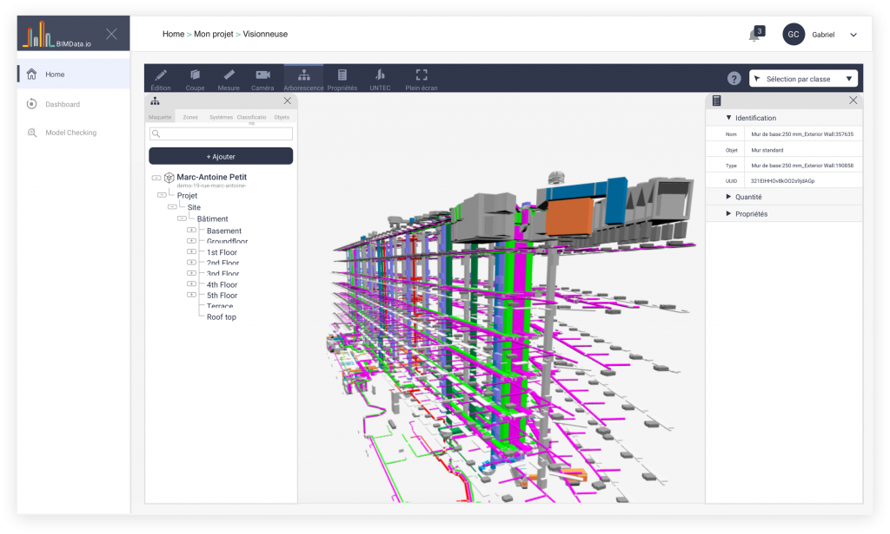
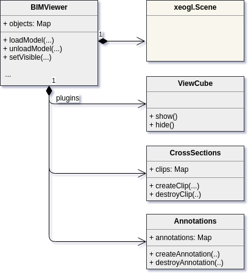
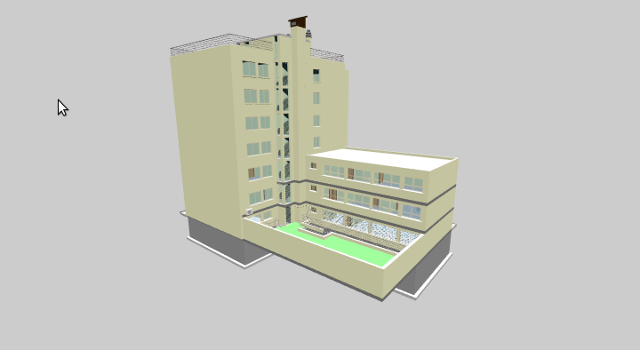
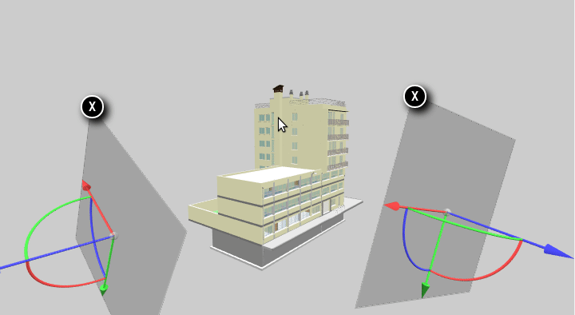
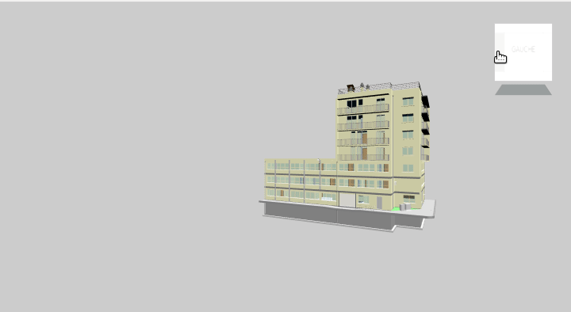
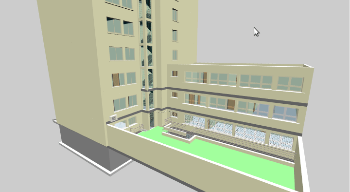
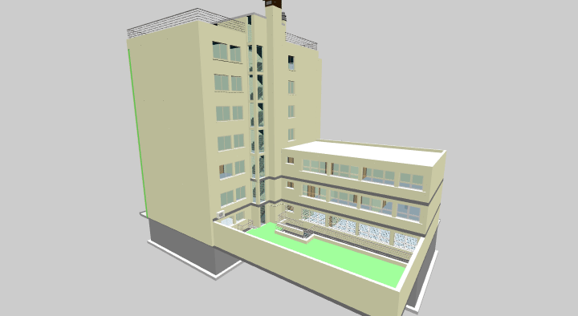
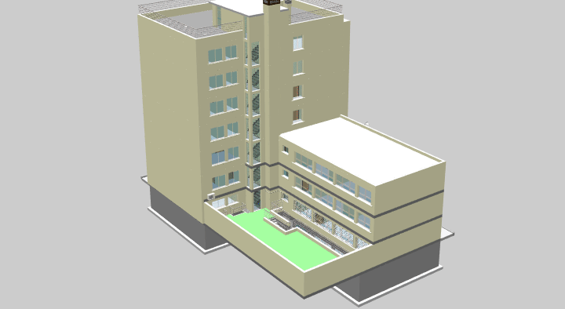

At [BIMData.io](https://bimdata.io) we developed the WebGL-based 3D viewer within our online building information modeling (BIM) platform.

We developed the viewer on [xeogl](http://xeogl.org/), an open source WebGL library created by [Lindsay Kay](http://xeolabs.com) for developing 3D model visualization applications in Web browsers without using plugins. 

In this article, I’ll describe some of the features that we implemented within the viewer. 

*Please note :* Most of this article is taken from Lindsay Kay's [article](http://xeolabs.com/portfolio/bimdata), who was kind enough to let me adapt it ! :-)



# Background
**BIM** is a process involving the generation and management of digital representations of physical and functional characteristics of buildings, usually while constructing them. 

**WebGL** is is a JavaScript API for rendering interactive 2D and 3D graphics within any compatible web browser, without the use of plug-ins. While IFC viewers are typically written as desktop applications, using the likes of OpenGL or DirectX, writing them on WebGL gives us the advantage of being able to view them on the web. 

With IFC visualization, the main challenge is how to engineer a WebGL-based viewer that’s able to render huge quantities of objects within the memory and execution constraints of the browser. After all, IFC models often contain an individual element for every single fire sprinkler, electrical fitting, light panel, and so on.

# The Company

[BIMData.io](https://bimdata.io) is a company in Lyon, France that provides a cutting-edge online BIM platform to manage your construction projects, including an all-in-one solution to visualize, check, edit and share building information.

# The Contractor

[Lindsay Kay](http://xeolabs.com) is a freelance software engineer developing WebGL-based 3D libraries and apps for visualizing BIM, MedViz and CAD on the Web.

# Requirements
* Implement a WebGL-based viewer in JavaScript, to view large 3D IFC models in Web browsers, without plugins
* Load IFC models from glTF
* Emphasise and reveal objects using ghosting, wireframing and highlighting
* Ability to annotate models with 3D labels
* Cross section views
* Isolated object views
* Measurement tools, to find areas and distances within models
* A camera navigation gizmo similar to AutoDesk ViewCube
* Orbit, first-person and walk-through navigation modes
* Ability to capture and share views via BCF format

# Solution

## Using xeogl
Lindsay implemented the BIMData viewer as a wrapper around [xeogl](http://xeogl.org/), which is an open source library created by Lindsay Kay for WebGL-based visualization. 

xeogl is also used in other commercial projects and is starting to receive contributions from other developers. This means that improvements and optimizations that made to xeogl for those projects will also benefit the BIMData platform. 

Being geared to engineering visualization, xeogl supports many of this project’s requirements out-of-the-box. For the more application-specific requirements, Lindsay extended it with proprietary components, for things like custom camera controls and interaction widgets.

## Sub-contracting
For this job Lindsay sub-contracted [David Lenaerts](http://www.derschmale.com/), a freelance graphics programmer, to help out with the math for 3D gizmo interactions. I’d recommend David to any developer who needs help with their WebGL projects.

## Application architecture
Our viewer is a facade class that wraps xeogl in a set of application-specific functions, with a plugin architecture into which we can incrementally add tools and gizmos. 



This plugin architecture enabled us to deploy the core functionality of the viewer as soon as it was ready, then deploy various tools and gizmos incrementally, as we developed them.

## glTF geometry pipeline
We’re using [glTF](https://www.khronos.org/gltf/) as the file format for our IFC models. Within the viewer, we’re loading glTF into the 3D scene using xeogl’s [GLTFModel](http://xeogl.org/docs/classes/GLTFModel.html) components.

### Geometry compression and batching
glTF gives us options for geometry compression, such as attribute quantization, in which floating-point geometry arrays are compressed into integers, then decompressed on-the-fly within the WebGL vertex shader. This gives us smaller glTF files, a smaller viewer memory footprint and reduced usage of GPU bandwidth. 

When the glTF geometry is not quantized, then xeogl automatically quantizes it while loading. At the same time, xeogl also automatically combines geometries from multiple objects into the same vertex buffer objects (VBOs), in order to reduce the number of VBO binds per frame. This enables us to render models up to around 200k+ objects.

```
For the next version of xeogl (v0.9), Lindsay is currently adding geometry batching in combination with instancing (using the ANGLE_instanced_arrays extension), which will enable BIMData to load millions of objects.
```

## User annotations
Annotations are notes that users pin to the surface of models. Our annotations are based on xeogl’s experimental [Annotation](http://xeogl.org/docs/classes/Annotation.html) components. 

These are able to automatically hide themselves whenever something else occludes them in the 3D view. 



## Cross-section views
Our users can create an unlimited number of cross-section planes, which they can arrange using mouse and touch input. 

Under the hood, our cross-section planes use xeogl’s [Clip](http://xeogl.org/docs/classes/Clip.html) components, which users can interactively arrange using our fancy repositioning gizmo. That was one of the bits that David Lenaerts helped out with. 



## ViewCube camera controller
Our ViewCube is a 3D camera orientation indicator and controller, which works the same as the one by Autodesk Research. Ours is a 3D gizmo Lindsay implemented on xeogl, with clickable hotspots that fly the camera to various vantage points. 



## Isolated object view
WIP

## Emphasis effects
xeogl has some built-in emphasis effects, such as ghosting and wireframe. We’re using those for highlighting and revealing BIM objects. 



Edge emphasis and ghosting effects for X-ray view: 



## Measurement tools
Our viewer has a bunch of tools to measure distances, angles and areas.

### Simple distance
Using the distance measurement tool, users can select a pair of points on the surfaces of objects and get the direct distance between them, as well as the distance on each of the X,Y and Z axis individually. Under the hood, this tool uses xeogl’s 3D picking mechanism, while the distance tool itself is rendered using HTML elements layered over the WebGL canvas. 



## Camera navigation
Camera navigation uses a custom xeogl component that allows users to control the camera with mouse and touch input. With our navigation component, users can orbit a point-of-interest, fly to selected objects, navigate in first-person mode, and “walk” to a point that they click on.

TODO: animated gif

## BCF
The BIM Collaboration Format (BCF) is an open file format that supports workflow communication in BIM processes. 

Our BCF system captures the complete visual state of the viewer as a JSON BCF record, that contains all the relevant viewer state, such as object visibilities and emphasis appearance, camera position, cross-section planes, annotations, as well as PNG snapshot image of the canvas. 

Users can capture a BCF record of the viewer state, to indicate an issue within a model, then share that with other users, who can then load that view to see what the problem is.

# Conclusion
We were really happy to work with [Lindsay Kay](https://xeolabs.com) as it helped us increase the viewer's quality and performance a lot. It was enjoyable to see a continuous incoming stream of quality JavaScript code coming our way (which is not so common).