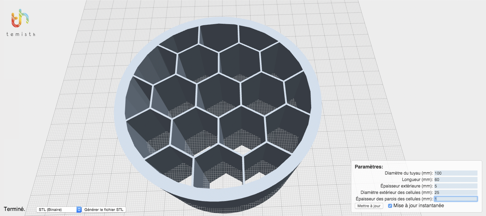
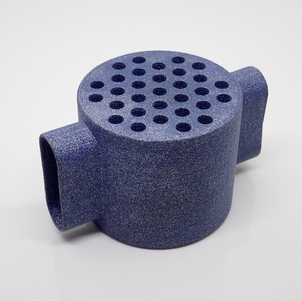
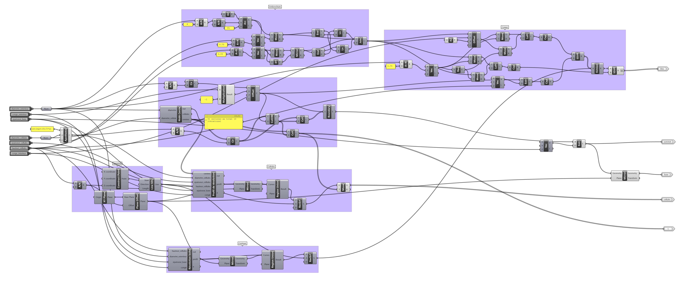
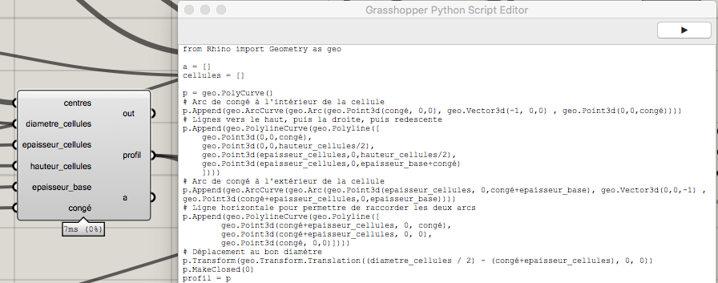
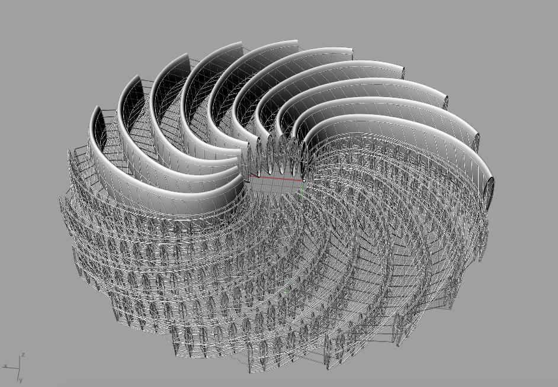

πTherm (pronounced PiTherm) is a parametric heat exchanger initiated by the [Temisth](http://temisth.com/) company based in Marseille, France. Those heat exchangers are designed specifically for metal additive manufacturing, to allow for complex shapes.

Temisth is a thermal engineering R&D company. It develops news heat exchangers for various industries including aerospace. πTherm is a R&D project whose objective is to optimize heat exchanges using all the potential of metallic additive manufacturing. I helped them by designing a dedicated *generative design* tool to create infinite 3D variations of a heat exchanger from a set of constraints defined by the user. Those 3D models are meant to be 3D printing in metal, because it would be very hard to manufacture them with other technologies. 

## The proof of concept

For this proof on concept, I developed an online 3D configurator with OpenJsCAD which generates 3D models containing honeycomb structures ready for 3D printing according to user-supplied parameters : the overall dimensions of the pipe, and the diameter and thickness of the holes.

Using OpenJsCAD, which is an online tool available on any browser, frees the user from having to buy and setup a dedicated 3D modeling software on her computer.

The purpose of the proof of concept is to validate the relevance of such an online tool, and the ease of use of such a system.

You can see a preview of the system above, and see it live below or [here](https://openjscad.org/?uri=https://smor.fr/projects/pitherm-nida.jscad){:target="_blank"}.

<iframe src="https://openjscad.org/?uri=https://smor.fr/projects/pitherm-nida.jscad"
        frameBorder="0" 
        width="800px" height="600px">
</iframe>

## πTherm NidA

Building on the success of the proof of concept, Temisth asked me to design a complete system for a complete design going all the way to 3D printing it in metal.

The final heat exchanger pictured above was 3D printed using Shapeways' online services in *alumide*, which is an alloy of PLA and aluminum.

I used the Rhinoceros3D software and its generative design plugin Grasshopper to design the model. 

After some iterations, I ended up developing a custom Grasshopper module in Python, to gain performance and make the script simpler.

Here is one configuration of the final model.



## πTherm Circular Heat Exchanger

Upon request from one of Temisth's clients, we developed a new proof of concept around πTherm, with a circular heat exchanger. Its purpose is to maximize the exchange surface thanks to lattices made of a multitude of "*strands*" laying inside the heat exchanger's branches.

I also used Rhinoceros3D and Grasshopper for this project, as well as the Grasshopper plugin *[Intralattice](http://intralattice.com)* by *[Aidan Kuntz](http://aidankurtz.com/)*.