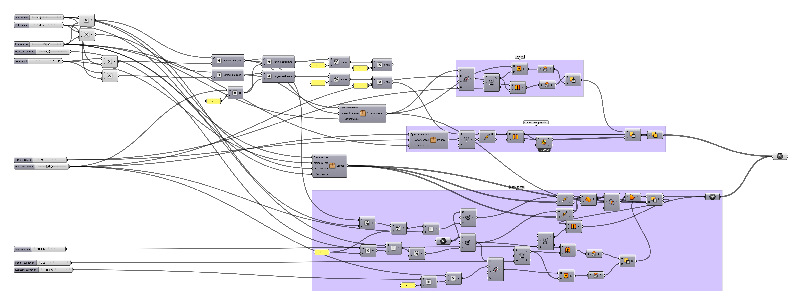



This is a tray designed as a reusable carrying devices for artisanal yoghurts produced by the local cheese factory and shop [Fromagerie Neuvilloise Le Gone](http://www.fromagerieneuvilloise.fr). It is meant to be 3D printed with FDM 3D printers. The low volume (~300 pieces) should be produced in a month using several 3D printers in parallel.

I created a Rhinoceros3D Grasshopper script and uploaded it to [ShapeDiver](https://shapediver.com) to create an online 3D configurator out of it.

The online 3D configurator is available here: [Yoghurt Tray on ShapeDiver](https://shapediver.com/m/yoghurt-tray).

Please note that not all configurations are possible, and that this script is pretty much a work in progress and a showcase. The initial demand was for a tray of 2x3 yoghurt pots, and others configurations are optional.

Here is what the Grasshopper script looks like. I factorized some common functionalities under Grasshopper "*clusters*" which appear as a single block in the picture above. The full graph should thus appear much more complex than it actually looks.
